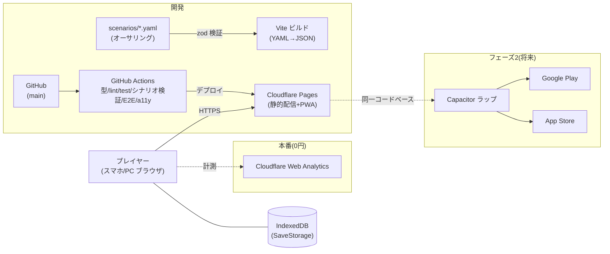

# crypto-riddle

暗号パズル×謎解きで、ハッカーの攻撃から防衛するセキュリティ学習ゲーム（Web アプリ / スマホブラウザ対応）。

※ プロジェクト名は仮決め（2026-07-20）。正式名称は spec 承認までに確定する。

## コンセプト

- **謎解きゲームのような形で、正答することでマップを進む**（全10〜20マップ想定）
- 各マップでは**攻撃側のハッカーの手段を探り、ヒントを探して防衛する**
- **使う暗号をパズルのように組み合わせる**メカニクスが核
- 難易度基準は情報処理安全確保支援士（SC）レベル。遊びながらセキュリティ知識が身につく学習ゲーム

## ドキュメント

仕様書は本リポジトリ内で管理する（GitHub Spec Kit / 仕様書ファースト。ゲーム開発拡張フロー適用）。

| ドキュメント | 内容 |
|--------------|------|
| [specs/001-mvp/spec.md](specs/001-mvp/spec.md) | MVP 仕様書（GDD 相当。ゲート①承認済み） |
| [specs/001-mvp/plan.md](specs/001-mvp/plan.md) | 実装計画（TDD 相当。技術スタック・アーキテクチャ。ゲート②承認済み） |
| [specs/001-mvp/tasks.md](specs/001-mvp/tasks.md) | タスク分解（実装順序 T001〜T029・依存関係・Issue 対応表） |
| [DESIGN.md](DESIGN.md) | UI デザイン仕様（カラートークン・タイポ・8画面×4状態） |
| [docs/characters.md](docs/characters.md) | キャラクターバイブル（霧島 悠／橘 澪） |
| [docs/term_cards.md](docs/term_cards.md) | 用語カードマスタ・誤用検出クイズ設計（Issue #4） |
| [docs/architecture.md](docs/architecture.md) | 環境構成図（Mermaid） |
| [docs/concept.md](docs/concept.md) | 初期コンセプトメモ（歴史的経緯。正本は specs/） |
| [docs/scenario_schema.md](docs/scenario_schema.md) | シナリオ記述フォーマット（`schemas/scenario.schema.json`・`scenarios/*.yaml`・`legal/*.yaml`） |

## アーキテクチャ / 構成図

MVP は**サーバーレス（静的配信のみ・0円運用）**。セーブは端末の IndexedDB、シナリオは YAML→zod 検証→JSON のビルド時固定。詳細は [docs/architecture.md](docs/architecture.md)。

