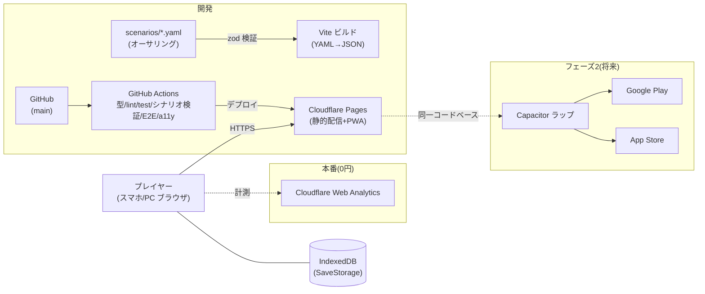

# crypto-riddle — 環境構成図

> plan.md（`specs/001-mvp/plan.md`）§8 の正本。構成が変わる実装をしたら、同じコミットで本図と README を更新する。

## 全体構成（MVP = Web/PWA、0円運用）

## 構成の要点

- **サーバーレス**: 静的配信のみ。API・DB サーバーは持たない（セーブは端末の IndexedDB）
- **シナリオはビルド時固定**: YAML → zod 検証 → JSON。クライアントに YAML パーサを載せない。不正シナリオは CI で fail
- **アーキテクチャ原則**: `core/`（純 TypeScript）は `ui/`（React）を import しない（plan.md §2）
- **フェーズ2（将来）**: 同一コードベースを Capacitor でラップし Google Play / App Store へ。着手は代表判断（plan.md §7）
