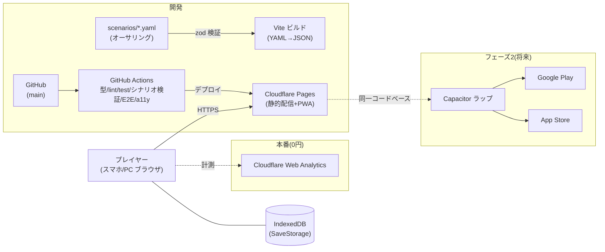

# crypto-riddle — MVP 実装計画（plan.md）

> 本書は spec-kit フローの `plan.md`（どう作るか）に相当する。ゲーム開発拡張フローの TDD 相当。
> 仕様の正本は `specs/001-mvp/spec.md`、UI は `DESIGN.md`、登場人物は `docs/characters.md`。

## 1. 技術スタック（advisor 条件付き承認済み）

| 項目 | 決定 | 理由 |
|---|---|---|
| 言語 | **TypeScript（strict）** | 型安全。core の単体テスト前提 |
| ビルド | **Vite** | 軽量・高速。静的出力 |
| UI | **React + Tailwind CSS + shadcn/ui** | DESIGN.md 確定構成。DOM のまま WCAG 2.1 AA を満たす |
| 状態管理 | **Zustand（+ persist）** | 小規模に十分。Redux は過剰 |
| D&D | **dnd-kit** | キーボードセンサー標準。**タップ配置を第一操作**、ドラッグは補助（WCAG 2.5.1/2.5.7） |
| シナリオ | **YAML →（ビルド時）zod 検証 → JSON** | クライアントに YAML パーサを載せない。zod スキーマが正、YAML は入力形式（#3 の前提） |
| セーブ | **`SaveStorage` インターフェース + IndexedDB 実装** | 直書き禁止。スキーマ `version`＋マイグレーション必須 |
| ホスティング | **Cloudflare Pages**（無料枠） | 静的配信で 0 円運用。計測は Cloudflare Web Analytics（cookie レス） |
| CI/CD | **GitHub Actions** | 型 → lint → 単体テスト → シナリオ検証 → E2E → a11y → Pages デプロイ |
| テスト | **Vitest**（core 高カバレッジ）／**Playwright**（4マップ通し E2E）／**axe-core**（自動 a11y）＋キーボード完遂の手動チェックリスト | |

### ゲームエンジンの採否（spec §11-12 のクローズ）

**不採用（advisor 承認済み・2026-07-29）**。本作はテキスト会話・カード配置・厳密一致判定が中心で、リアルタイム描画・物理は不要。Canvas/WebGL 系（Phaser/Godot/Unity）は WCAG AA が実質二重実装になり、DESIGN.md（Tailwind/shadcn）とも不整合。バンドル重量のコストのみが残るため見送る。将来リッチな演出が中核になる企画で再検討する。

### Flutter（次点）の発動条件（記録）

以下の**2つ以上**が成立したら Flutter へ転換を再検討する: ①モバイルストア版が主戦場化し Web の WCAG AA 要件を縮小できる ②terra-town と Flutter 資産を一本化する経営判断 ③将来タイトルでリッチ演出・端末機能統合が中核になる。

## 2. アーキテクチャ原則（advisor 承認条件①）

```
src/
├── core/     # 純粋 TypeScript。React を import してはならない
│   ├── scenario/   # シナリオ進行（明示的ステートマシン）
│   ├── judge/      # 判定（単一解・厳密一致＋正規化）
│   ├── save/       # SaveStorage IF・スキーマ・マイグレーション
│   └── model/      # 型定義（zod スキーマから生成）
├── ui/       # React コンポーネント（表示と入力操作のみ）
└── data/     # ビルド時に YAML から生成された JSON
```

- **`core/` は `ui/` を import しない**（依存は ui → core の一方向）。terra-town の GPS_ARCHITECTURE と同じ思想
- 目的: 将来の Flutter/ネイティブ転換の保険、判定ロジックの単体テスト容易化

## 3. 判定の正規化仕様（advisor 指摘）

厳密一致判定（spec §8.2）の前段で以下を正規化する（詳細は実装時に `core/judge/` の仕様コメント＋テストで確定）:

- Unicode NFKC（全角/半角統一）、大文字→小文字、カタカナ→ひらがな、前後空白・連続空白の除去
- 対象はカード ID 照合が基本のため文字列入力は限定的だが、入力式の謎（暗号解読の答え等）に適用

## 4. シナリオデータパイプライン（#3 との接続）

```
scenarios/*.yaml → (build) zod 検証 → src/data/*.json → アプリが import
```

- zod スキーマが**正**。YAML はオーサリング用入力形式（#3 のスキーマ定義はこの前提で着手する）
- 不正シナリオは CI で fail。法制度データ（条文・報告期限）は別ファイルに分離し参照（改正時に差し替え可能）
- 正解データはまず平文で持つ（学習ゲームのため過剰なネタバレ対策はしない。気になれば正解のみハッシュ照合に切替可能な設計に留める）

## 5. データモデル（概要）

- **Scenario**: id / title / 分野タグ / 難易度 / 想定時間 / 出典 / parts(導入・探索・解決) / cards / judge / 防衛策
- **Card**: id / 種別（証言・ログ・通信記録・外部情報・暗号文・鍵・対策）/ 出所（人物・機器）/ 本文 / ダミーフラグ / 用語カード参照
- **TermCard**（#4）: id / 用語 / 読み / 定義 / 分野タグ / 関連用語 / 出典
- **SaveData**: version / クリア状況 / 獲得カード / 分野習熟 / XP / 設定
- 詳細スキーマは `#3`（zod/YAML）で確定する

## 6. セーブ設計（advisor 承認条件③）

- `SaveStorage` インターフェースを定義し、Web=IndexedDB（idb）、フェーズ2の Capacitor=Preferences/Filesystem で差し替え
- スキーマに `version` を持たせ、マイグレーション関数を最初から用意
- **エクスポート/インポート機能を MVP 要件に昇格**（iOS Safari の 7 日ストレージ削除対策。将来のアカウント同期の布石）。spec FR に追記する
- SaveData は「アカウント同期時にそのままサーバへ送れる」自己完結 JSON として設計

## 7. モバイル対応（フェーズ2・advisor 承認条件②）

- **MVP は Web（PWA）のみで出荷**。Capacitor ラップは**フェーズ2**とし、着手トリガーは代表判断（目安: 継続利用が確認できた時点／ストア配信の事業判断）
- フェーズ2の Apple 審査対策（Guideline 4.2 / 2.5.2）を先に記録: ①全アセット同梱でオフライン完動 ②Haptics・ローカル通知等ネイティブプラグインを1つ以上実用 ③実行コードのリモート配信禁止（シナリオ**データ**の追加配信は可）

## 8. 環境構成図

`docs/architecture.md`（Mermaid）に作成し、README に掲載する。



## 9. 画面一覧

DESIGN.md の 8 画面 × 4 状態に準拠（タイトル／マップ選択／導入／探索／解決／失敗解説／結果／カード図鑑）。

## 10. リスクと対応

| リスク | 対応 |
|---|---|
| iOS Safari の 7 日ストレージ削除 | セーブのエクスポート/インポートを MVP 要件化（§6） |
| 日本語入力の誤判定 | 正規化仕様＋core 単体テスト（§3） |
| シナリオデータの破損・不整合 | zod 検証を CI に組込み（§4） |
| Apple 審査却下（フェーズ2） | 4.2/2.5.2 対策を事前記録（§7） |
| スコープ肥大 | MVP=4 マップ・Web のみ。エンジン不採用・複数解見送りを決定として維持 |

## 11. 実装順序（tasks.md の骨子）

1. リポジトリ足場（Vite+React+TS+Tailwind+shadcn、CI、Cloudflare Pages 接続）
2. `core/` の型・zod スキーマ（**#3 と同時**）・SaveStorage・判定
3. UI 骨格（8 画面のルーティングと 4 状態）
4. S1 データ（#5）で縦スライス（1 マップ通しプレイ＝spec-kit のバーティカルスライス）
5. 代表プレイテスト → 調整 → S2/S3/法務マップ量産（#6）
6. 用語カード（#4）・図鑑・エクスポート/インポート
7. a11y 仕上げ（axe/キーボード完遂）→ 公開

## 12. spec への反映事項（本 plan 承認時に実施）

- spec §11-12（ゲームエンジン）: 「advisor 承認のうえ不採用」でクローズ
- spec FR に「セーブデータのエクスポート/インポート」を追加（FR-9）
- spec §11-13（terra-town との優先順位）は経営判断のため引き続き代表管理
