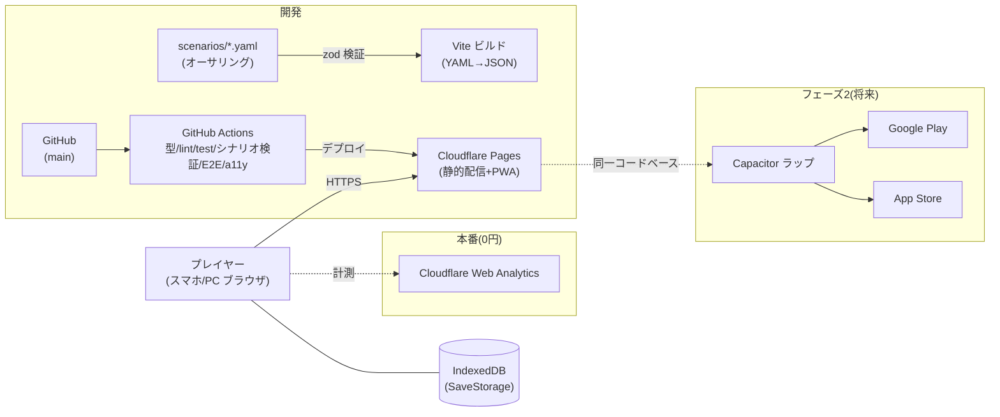

# crypto-riddle — MVP 実装計画（plan.md）

> 本書は spec-kit フローの `plan.md`（どう作るか）に相当する。ゲーム開発拡張フローの TDD 相当。
> 仕様の正本は `specs/001-mvp/spec.md`、UI は `DESIGN.md`、登場人物は `docs/characters.md`。

## 1. 技術スタック（advisor 条件付き承認済み）

| 項目 | 決定 | 理由 |
|---|---|---|
| 言語 | **TypeScript（strict）** | 型安全。core の単体テスト前提 |
| ビルド | **Vite** | 軽量・高速。静的出力 |
| UI | **React + Tailwind CSS + shadcn/ui** | DESIGN.md 確定構成。DOM のまま WCAG 2.1 AA を満たす |
| 状態管理 | **Zustand（+ persist）** | 小規模に十分。Redux は過剰 |
| ~~D&D（dnd-kit）~~ | **不要（#42 で会話モード化）** | 解決パートがカード配置→**選択肢ボタン**方式に変わり、ドラッグ操作が無くなったため dnd-kit を削除する。選択式のほうがキーボード完遂が素直（WCAG）。カード閲覧はドロワー（D&D なし） |
| シナリオ | **YAML →（ビルド時）zod 検証 → JSON** | クライアントに YAML パーサを載せない。zod スキーマが正、YAML は入力形式（#3 の前提） |
| セーブ | **`SaveStorage` インターフェース + IndexedDB 実装** | 直書き禁止。スキーマ `version`＋マイグレーション必須 |
| ホスティング | **Cloudflare Pages**（無料枠） | 静的配信で 0 円運用。計測は Cloudflare Web Analytics（cookie レス） |
| CI/CD | **GitHub Actions** | 型 → lint → 単体テスト → シナリオ検証 → E2E → a11y → Pages デプロイ |
| テスト | **Vitest**（core 高カバレッジ）／**Playwright**（4マップ通し E2E）／**axe-core**（自動 a11y）＋キーボード完遂の手動チェックリスト | |

### ゲームエンジンの採否（spec §11-12 のクローズ）

**不採用（advisor 承認済み・2026-07-29）**。本作はテキスト会話・カード配置・厳密一致判定が中心で、リアルタイム描画・物理は不要。Canvas/WebGL 系（Phaser/Godot/Unity）は WCAG AA が実質二重実装になり、DESIGN.md（Tailwind/shadcn）とも不整合。バンドル重量のコストのみが残るため見送る。将来リッチな演出が中核になる企画で再検討する。

### Flutter（次点）の発動条件（記録）

以下の**2つ以上**が成立したら Flutter へ転換を再検討する: ①モバイルストア版が主戦場化し Web の WCAG AA 要件を縮小できる ②terra-town と Flutter 資産を一本化する経営判断 ③将来タイトルでリッチ演出・端末機能統合が中核になる。

## 2. アーキテクチャ原則（advisor 承認条件①）

```
src/
├── core/     # 純粋 TypeScript。React を import してはならない
│   ├── scenario/   # シナリオ進行（明示的ステートマシン）
│   ├── judge/      # 判定（会話モードの選択肢判定＝問い単位で単一解・厳密一致／暗号は正規化＋照合）
│   ├── save/       # SaveStorage IF・スキーマ・マイグレーション
│   └── model/      # 型定義（zod スキーマから生成）
├── ui/       # React コンポーネント（表示と入力操作のみ）
└── data/     # ビルド時に YAML から生成された JSON
```

- **`core/` は `ui/` を import しない**（依存は ui → core の一方向）。terra-town の GPS_ARCHITECTURE と同じ思想
- 目的: 将来の Flutter/ネイティブ転換の保険、判定ロジックの単体テスト容易化

## 3. 判定の正規化仕様（advisor 指摘）

厳密一致判定（spec §8.2）の前段で以下を正規化する（詳細は実装時に `core/judge/` の仕様コメント＋テストで確定）:

- Unicode NFKC（全角/半角統一）、大文字→小文字、カタカナ→ひらがな、前後空白・連続空白の除去
- 対象はカード ID 照合が基本のため文字列入力は限定的だが、入力式の謎（暗号解読の答え等）に適用

## 4. シナリオデータパイプライン（#3 との接続）

```
scenarios/*.yaml → (build) zod 検証 → src/data/*.json → アプリが import
```

- zod スキーマが**正**。YAML はオーサリング用入力形式（#3 のスキーマ定義はこの前提で着手する）
- 不正シナリオは CI で fail。法制度データ（条文・報告期限）は別ファイルに分離し参照（改正時に差し替え可能）
- 正解データはまず平文で持つ（学習ゲームのため過剰なネタバレ対策はしない。気になれば正解のみハッシュ照合に切替可能な設計に留める）

## 5. データモデル（概要）

- **Scenario**: id / title / 分野タグ / 難易度 / 想定時間 / 出典 / parts(導入・探索・解決) / `investigation_points` / cards / `scenes`（探索の表示層・省略可）/ resolution（**会話モード**: 暗号ステージ＋**問い列 questions**）
  - **resolution（#42 で刷新）**: `cipher_stages`（維持・S1 は0件）＋ `questions[]`（各問い = 問い文・分野タグ・**2〜3択の選択肢**〔各選択肢に正誤と誤答時の返答〕・段階的に深まる解説・相談用の詳細ヒント）。旧 `attack_identification` / `countermeasure`（`required_card_ids` 方式）は questions へ統合。**schema_version 0.2.0 → 0.3.0**。問いの分野タグで解説役が決まる（技術→霧島／法務→橘。`docs/characters.md`）
  - **scenes（#52 で追加・探索の背景シーン表示層）**: `investigation_points`（カードの出所・3系統）は**正のまま維持**し、表示層として**省略可能な `scenes[]`**（背景アセットID・複数シーン切替・`hotspots[]`〔オブジェクト種別 PC/人物/書籍/機器・相対座標・ラベル・`actions[]`〕）を追加。`actions[]` は `collect`（`investigation_point_id` を参照してカード獲得）／`danger`（電源を落とす等＝教育的フィードバックのみ・ペナルティなし）／`noop`。1オブジェクトが複数ポイントを束ねられる（hotspot→point は 1:N）。**`scenes` 省略時は一覧表示にフォールバック**（背景なしでも成立）。整合性チェック＝各 `investigation_point` がちょうど1つの collect action から参照される。**schema_version 0.3.0 → 0.4.0**。背景は**横16:9／縦9:16**（画面の向きで切替。#119）・image_agent 自作（DESIGN.md「探索シーン」節）
  - **探索の会話フレーム化（#52 Phase 4.7・T018'' 反映）**: 調査結果（人物証言・PC のログ・書籍の文献）を解決と同じ会話フレームで台詞提示する。そのため `collect` アクションに**省略可能な `line`（台詞）と `speaker`**（`danger` の `feedback` と対称）を追加し、省略時は既定の導入文＋カード本文にフォールバック。既定話者は3系統から導出（ログ→霧島／証言→橘／文献→橘）。**schema_version 0.4.0 → 0.5.0**（既存 YAML の版数追随は T037 と同手順）。会話フレーム共通で**タイプライター表示**（スキップ可・reduced-motion 即全文・支援技術には全文提供）を導入。ホットスポットは通常不可視でホバー/フォーカス時に□マーカー（`aria-label` 保持・一覧フォールバック維持）。旧「非ダミー先頭を証言として読む」経路が消えるため **#62 を吸収**
  - **探索の動線・統合（#52 Phase 4.7・T018'''' 反映）**: アクション種別に **`goto`（シーン移動・移動先シーンID を指定）** を追加、`object_type` に **`door`** を追加、ホットスポットに**省略可能な `prompt`（挨拶台詞）**を追加。ドアでシーン移動（タブと併用）、物理的に同じ場所の人と機器は1ホットスポットに統合（サーバ管理者＝証言＋PC）。整合性チェックに「`goto.scene_id` が実在し自シーン以外」を追加（既存の collect 参照チェックは無影響）。**schema_version 0.5.0 → 0.6.0**（版数追随は同手順）。背景の再生成はしない
  - **S1 会話フロー刷新（Phase 4.8・#100 で仕様確定／#101 で実装予定）**: 台本v2.2 対応のため7点を改訂——① `characterSchema` を3値（霧島/橘/小鳥遊）に拡張 ② `expressionSchema` を新設し `dialogueLineSchema` に**省略可能な `expression`** を追加 ③ `introSchema.background` を省略可に緩和 ④ `collect` に**省略可能な `dialogue`（多ターン・`line`/`speaker` とは併用不可）**を追加 ⑤ **NPC直接発話**（`npc`+`line`）を `collect.dialogue` 限定の union として新設 ⑥ `questions[].explanations` を `string | dialogueLineSchema` の union 配列に緩和 ⑦ **schema_version 0.6.0 → 0.7.0**。すべて省略可の追加／緩和のため **S2/S3/SL は無改訂で有効**（`schema_version` の値のみ #103 で更新）。**小鳥遊は導入(`intro.character_intros`)と結果(`resolution.clear_explanation`)にのみ使用可**（`superRefine` で拒否。拒否理由・描画レイアウトとの関係は Phase 4.9／#108 で改訂）。詳細フィールド構成は `docs/scenario_schema.md` §2.6
  - **会話フレームの左右2枠入れ替わり方式・立ち絵拡大・導入クリック送り（Phase 4.9・#108 で仕様確定／#110 で実装予定）**: S1 実装台本レビュー第1回（2026-09-13 代表）を受け、#100 で定めた「探索④・解決⑤＝霧島＝左・橘＝右の固定2枠／導入③のみ小鳥遊を加えた3枠の対策室レイアウト」を撤回し、**導入・探索・解決のすべてで左右2枠の入れ替わり方式**に統一する。最初の話者は左（右は空）。画面にいる人が話せば自分の枠をカラー・他方をグレーにし、画面にいない人が話せば直前の話者ではない枠（空ならそこ）に入れ替えて直前の話者をグレーにする。NPC が話すときは枠を動かさず両方グレー＋名札に NPC 名を出し、その次に支援役が話すときは NPC の前に話していた支援役を「直前の話者」として扱う。並びは**導入の開始・探索の会話1つごとの開始・解決の開始**でリセットし、**解決は問1→問2でも保つ**。小鳥遊の「導入のみ3枠（対策室レイアウト）」は廃止し、他の2名と同じ2枠の決まりに従う（登場範囲＝①導入・⑦結果のみは変更なし）。あわせて**立ち絵を会話ウィンドウの上に乗る大きさまで拡大**（デスクトップ 幅240×高さ320px／モバイル 幅120×高さ160px。透過・切り抜きはしない・8ptグリッド準拠。**この px 指定は #119 で背景の箱の高さに対する比率指定へ撤回**）し、**導入の「タップで進行」ボタンを廃止して探索と同じ画面クリック送り**（Enter/Space 併用可）に統一する。**データモデル・zod スキーマへの変更は無し**（レイアウト・演出のみの変更のため #101 のスキーマ0.7.0実装・小鳥遊ガードの拒否条件そのものには影響しない。ガードの理由づけの記述のみ `docs/scenario_schema.md` §2.6 で更新）。詳細は `DESIGN.md`「会話フレーム」節・「探索シーン」節（#108）。**UI 実装は `T054-ui`（#110）で着手（PR #118）したが、#119 の改訂を受けてマージせず、レイアウトは `T060-ui`（#124）に引き継ぐ**
  - **背景を画面の向きで切り替え・重ね配置の一般化・話者枠・対策室背景の新規作成（Phase 4.10・#119 で仕様確定／#120〜#124 で実装予定）**: #108 の縦スライス後、代表フィードバック（2026-09-13）を受けさらに改訂する。①背景は**画面全体に表示**し立ち絵・会話フレームを**その上に重ねる**（背景の下に積まない）②背景は**画面の向き**（横長=16:9／縦長=9:16。デスクトップ用の横背景は維持）で切り替える。切替判定は画面幅ではなく `orientation` ③**いま話している人の立ち絵に黒または白の枠**を付ける（色は S1 試作で両案を代表が選ぶ＝未決）④導入の背景は `bg-sl-office` の流用をやめ、**対策室の新規背景 `bg-hq-taskforce`**（横・縦。4人分の机とPC・人物は描かない）を作成する⑤ホットスポット座標は**横・縦の組**に改訂（`scenes[].hotspots[].position`、schema 0.8.0）。縦の背景が無いマップは当面 `portrait` を省略でき、縦長の画面でも横の背景を背景の箱に収めて表示する。4マップすべてに縦が揃ったら必須化する。**データモデルは `position` のみ変更**（0.7.0→0.8.0）。zod 実装は **core Issue #120**、S1 縦背景は **#121**、対策室背景は **#122**、S1 縦座標データ・導入背景差し替えは **#123**、UI 実装（背景の箱・重ね配置・立ち絵比率・話者枠・#110 の後継）は **#124**。詳細は `DESIGN.md`「会話フレーム」「探索シーン」「アセット」各節・`docs/scenario_schema.md` §2.7。委譲条件「**スキーマ差分は commit 前に報告して停止**」を維持
- **Card**: id / 種別（証言・ログ・通信記録・外部情報・暗号文・鍵・対策）/ 出所（人物・機器）/ 本文 / ダミーフラグ / 用語カード参照（探索で収集。会話モードのカードドロワーで閲覧）
- **TermCard**（#4）: id / 用語 / 読み / 定義 / 分野タグ / 関連用語 / 出典
- **SaveData**: version / クリア状況 / 獲得カード / 分野習熟 / XP / 設定 ＋ **会話モードの解答試行・相談使用回数**（XP 減算の算定と結果表示に使用。追加フィールドの後方互換／`version` 更新要否は実装 Issue で判断）
- 詳細スキーマは実装 Issue（#42 分解）で zod を改訂して確定する（会話モード化に伴う破壊的変更。データは s0/s1 の2本を同時移行）

## 6. セーブ設計（advisor 承認条件③）

- `SaveStorage` インターフェースを定義し、Web=IndexedDB（idb）、フェーズ2の Capacitor=Preferences/Filesystem で差し替え
- スキーマに `version` を持たせ、マイグレーション関数を最初から用意
- **エクスポート/インポート機能を MVP 要件に昇格**（iOS Safari の 7 日ストレージ削除対策。将来のアカウント同期の布石）。spec FR に追記する
- SaveData は「アカウント同期時にそのままサーバへ送れる」自己完結 JSON として設計

## 7. モバイル対応（フェーズ2・advisor 承認条件②）

- **MVP は Web（PWA）のみで出荷**。Capacitor ラップは**フェーズ2**とし、着手トリガーは代表判断（目安: 継続利用が確認できた時点／ストア配信の事業判断）
- フェーズ2の Apple 審査対策（Guideline 4.2 / 2.5.2）を先に記録: ①全アセット同梱でオフライン完動 ②Haptics・ローカル通知等ネイティブプラグインを1つ以上実用 ③実行コードのリモート配信禁止（シナリオ**データ**の追加配信は可）

## 8. 環境構成図

`docs/architecture.md`（Mermaid）に作成し、README に掲載する。



## 9. 画面一覧

DESIGN.md の 8 画面 × 4 状態に準拠（タイトル／マップ選択／導入／探索／解決／失敗解説／結果／カード図鑑）。

## 10. リスクと対応

| リスク | 対応 |
|---|---|
| iOS Safari の 7 日ストレージ削除 | セーブのエクスポート/インポートを MVP 要件化（§6） |
| 日本語入力の誤判定 | 正規化仕様＋core 単体テスト（§3） |
| シナリオデータの破損・不整合 | zod 検証を CI に組込み（§4） |
| Apple 審査却下（フェーズ2） | 4.2/2.5.2 対策を事前記録（§7） |
| スコープ肥大 | MVP=4 マップ・Web のみ。エンジン不採用・複数解見送りを決定として維持 |

## 11. 実装順序（tasks.md の骨子）

1. リポジトリ足場（Vite+React+TS+Tailwind+shadcn、CI、Cloudflare Pages 接続）
2. `core/` の型・zod スキーマ（**#3 と同時**）・SaveStorage・判定
3. UI 骨格（8 画面のルーティングと 4 状態）
4. S1 データ（#5）で縦スライス（1 マップ通しプレイ＝spec-kit のバーティカルスライス）
5. 代表プレイテスト → 調整 → S2/S3/法務マップ量産（#6）
6. 用語カード（#4）・図鑑・エクスポート/インポート
7. a11y 仕上げ（axe/キーボード完遂）→ 公開

## 12. spec への反映事項（本 plan 承認時に実施）

- spec §11-12（ゲームエンジン）: 「advisor 承認のうえ不採用」でクローズ
- spec FR に「セーブデータのエクスポート/インポート」を追加（FR-9）
- spec §11-13（terra-town との優先順位）は経営判断のため引き続き代表管理
